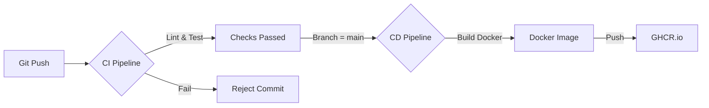

# CI/CD Pipeline Strategy

**Last Updated:** 2026-01-26
**Tooling:** GitHub Actions
**Registry:** GitHub Container Registry (GHCR)

---

## 1. Overview

Our CI/CD strategy is designed to ensure code quality and seamless delivery through automated workflows. We utilize **GitHub Actions** for both Integration and Deployment phases.

### Workflow Diagram

---

## 2. Continuous Integration (CI)

**Workflow File:** `.github/workflows/ci.yml`
**Trigger:** 
- Push to `main` folder
- Pull Requests to `main`

### Jobs Structure
The CI runs on a single `ubuntu-latest` runner to maximize cache hits.

1.  **Checkout**: Fetches repository code (depth 2 for commit history).
2.  **Setup Node.js**: Installs Node v20 and restores `~/.npm` cache.
3.  **Install**: Runs `npm ci` for deterministic installs.
4.  **Lint**: Runs `npm run lint` (ESLint across all apps/packages).
5.  **Build**: Runs `npm run build` (Turborepo build check).
6.  **Test**: Runs `npm run test` (Jest unit/integration tests).

**Rationale**:
We run these in series (rather than parallel jobs) to avoid the overhead of setting up Node_modules multiple times. Turborepo handles internal parallelism for lint/build/test tasks.

---

## 3. Continuous Deployment (CD)

**Workflow File:** `.github/workflows/cd.yml`
**Trigger:** 
- Push to `main` (only after CI passes if branch protection is enabled)

### Jobs Structure
1.  **Docker Build**: Uses `docker/setup-buildx-action` for multi-platform support.
2.  **Registry Login**: Authenticates with GHCR.io using `GITHUB_TOKEN`.
3.  **Build & Push (Web)**: Builds `apps/web/Dockerfile` and pushes to `ghcr.io/brandcoach/web`.
4.  **Build & Push (API)**: Builds `apps/api/Dockerfile` and pushes to `ghcr.io/brandcoach/api`.

**Caching**:
- Uses GitHub Actions Cache (`type=gha`) to speed up subsequent Docker builds by reusing layers.

---

## 4. Secrets Management

The following secrets are required in the GitHub Repository settings:

| Secret | Description | Required By |
| :--- | :--- | :--- |
| `GITHUB_TOKEN` | Automatically provided by GitHub | CD (Registry Login) |
| `DATABASE_URL` | DB Connection string | CI (If running E2E tests) |

*Note: For this initial setup, the CD pipeline builds container images but does not actively deploy them to EKS. The image update in Kubernetes is currently a manual step (or via GitOps/ArgoCD in Phase 2).*

---

## 5. Repository Configuration (Required)

To enable these pipelines, you must configure the following in your GitHub Repository:

### 1. Permissions
Go to **Settings > Actions > General**:
- [x] **Workflow permissions**: Select "Read and write permissions".
- *Rationale*: required for the CD pipeline to push images to the GitHub Container Registry.

### 2. Container Registry
The first time the pipeline runs, it will attempt to push packages. Ensure that **Packages** are enabled for your organization/repository in settings.

### 3. Secrets (Phase 2 Deployment)
When connecting to AWS infrastructure, add these under **Settings > Secrets and variables > Actions**:
- `AWS_ACCESS_KEY_ID`: IAM User with ECR/EKS permissions.
- `AWS_SECRET_ACCESS_KEY`: Secret key.
- `KUBE_CONFIG_DATA`: Base64 encoded kubeconfig (if pushing directly to K8s).
